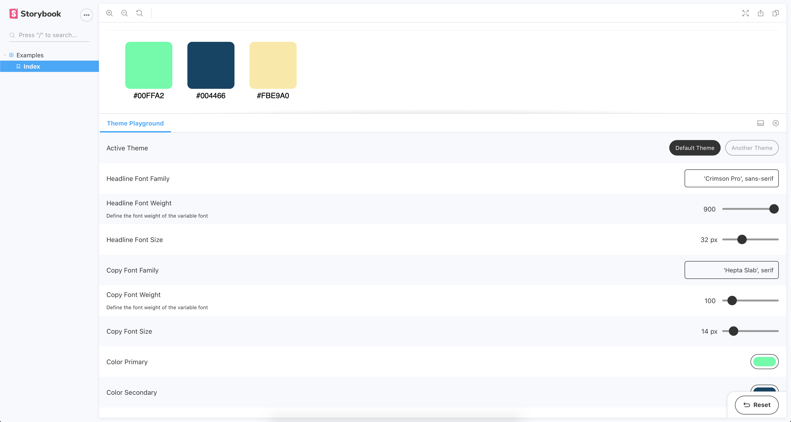

# storybook-addon-theme-playground

[](https://www.npmjs.com/package/storybook-addon-theme-playground)
[](https://www.npmjs.com/package/storybook-addon-theme-playground)
[](https://www.npmjs.com/package/storybook-addon-theme-playground)
[](https://github.com/prettier/prettier)

`storybook-addon-theme-playground` is a theme addon for storybook. It provides a panel where theme values can be tweaked directly.


[Example](https://storybook-addon-theme-playground.now.sh)

## Installation

#### 1. Install the addon

```sh
npm install -D storybook-addon-theme-playground

yarn add -D storybook-addon-theme-playground
```

#### 2. Register the panel

Add to `.storybook/addons.js`

```js
import 'storybook-addon-theme-playground/register';
```

#### 3. Add decorator

Add to `.storybook/config.js`.

```js
import { addDecorator } from '@storybook/react';
import { ThemeProvider } from 'styled-components';
import { withThemePlayground } from 'storybook-addon-theme-playground';

import theme from 'path/to/theme';

const options = {
  theme,
  provider: ThemeProvider
};

addDecorator(withThemePlayground(options));
```

... or to particular story

```js
import React from 'react';
import { ThemeProvider } from 'styled-components';
import { withThemePlayground } from 'storybook-addon-theme-playground';

import Button from './Button';

import theme from 'path/to/theme';

const options = {
  theme,
  provider: ThemeProvider
};

export default {
  title: 'Button with theme',
  decorators: [withThemePlayground(options)]
};

export const Primary = () => <Button>Primary Button</Button>;
```

## Options

### `theme`

`object` | `Array<{ name: string, theme: object }>` | required

The theme `object` or multiple themes as an `array` of `objects`. Look at the [Multiple Themes](#multiple-themes) section for an example.

### `provider`

`any` | required

Any provider component which will accept a theme object prop and children. `storybook-addon-theme-playground` has no default provider due to extendability.

### `overrides`

`object` | optional

Optional [override components](#override-components) of [default components](#default-components). Look at the [Overrides](#overrides) section for detailed documentation.

### `config`

`object` | optional

An additional config object can be added. Look at the [Config](#config) section for detailed documentation.

### `config.labelFormat`

`"path" || "startCase" || (path: string[]) => string` | default: `"startCase"`

### `config.debounce`

`boolean` | default: `true`

Set to `false` updating the theme values will not be debounced.

### `config.debounceRate`

`number` | default: `500`

### `config.showCode`

`boolean` | default: `true`

Set to `false` no code component will be rendered.

## Multiple Themes

To add multiple themes, add an `Array` to the `theme` key. Each theme must have a `name` and a `theme` key.

```js
import { ThemeProvider } from 'styled-components';
import defaultTheme from 'path/to/default/theme';
import anotherTheme from 'path/to/another/theme';

const options = {
  theme: [
    { name: 'Theme', theme: defaultTheme },
    { name: 'Another Theme', theme: anotherTheme }
  ],
  provider: ThemeProvider
};

addDecorator(withThemePlayground(options));
```

## Config

**Example**

```js
import { ThemeProvider } from 'styled-components';

addDecorator(
  withThemePlayground({
    theme: { button: { color: '#000' } },
    provider: ThemeProvider,
    config: {
      // One of "path"
      labelFormat: 'path', // "button.color"
      // or "startCase"
      labelFormat: 'startCase', // "Button Color"
      // or a custom function
      labelFormat: path => {
        // path is equal to ["button", "color"]
        return path.join('-'); // "button-color"
      },
      debounce: true || false,
      debounceRate: 500,
      showConfig: true || false
    }
  })
);
```

## Overrides

`storybook-addon-theme-playground` will render a [default component](#default-components) based on the theme value. If you want to customize them, you can override the default components by adding an `overrides` object to the decorator.

As a key use the theme object path, e.g `'button.spacing'`

**Example**

```js
import { addDecorator } from '@storybook/react';
import { ThemeProvider } from 'styled-components';
import { withThemePlayground } from 'storybook-addon-theme-playground';

import theme from 'path/to/theme';

const overrides = {
  'button.spacing': {
    type: 'counter',
    label: 'Button Spacing',
    description: 'Spacing for all buttons',
    min: 1,
    max: 20,
    steps: 1,
    suffix: 'rem'
  },
  'button.color.primary': {
    type: 'color',
    label: 'Button Primary Color'
  }
};

addDecorator(
  withThemePlayground({ theme, overrides, provider: ThemeProvider })
);
```

### Hide specific theme values

It is also possible to hide specific theme values or objects, e.g.:

```js
const overrides = {
  breakpoints: {
    hidden: true
  },
  'button.spacing': {
    hidden: true
  }
};
```

## Override components

### Color

```js
'theme.path': {
  type: 'color',
  hidden: Boolean,
  label: String | 'Theme Path',
  description: String | null
}
```

### Counter

```js
'theme.path': {
  type: 'counter',
  hidden: Boolean,
  label: String | 'Theme Path',
  description: String | null,
  min: Number | 0,
  max: Number | 100,
  steps: Number | 1,
  suffix: String | null
}
```

### Select

```js
'theme.path': {
  type: 'select',
  hidden: Boolean,
  label: String | 'Theme Path',
  description: String | null
  options: [
    {
      value: String,
      label: String
    }
  ]
}
```

### Shorthand

```js
'theme.path': {
  type: 'shorthand',
  hidden: Boolean,
  label: String | 'Theme Path',
  description: String | null
}
```

### Switch

```js
'theme.path': {
  type: 'switch',
  hidden: Boolean,
  label: String | 'Theme Path',
  description: String | null
}
```

### Range

```js
'theme.path': {
  type: 'range',
  hidden: Boolean,
  label: String | 'Theme Path',
  description: String | null,
  min: Number | 0,
  max: Number | 100,
  steps: Number | 1,
  suffix: String | null
}
```

## Default components

`storybook-addon-theme-playground` will render the following components based on the value.

### `Switch`

> `boolean`

### `Counter`

> `number`

### `Input`

> `string`

### `Textarea`

> `string` && `string.length >= 40`

### `Range`

> `string` && `string.endsWith("px" || "rem" || "em" || "%")`

### `Color`

> `string` && `string.startsWith("#" || "rgba" || "rgba")` || `label.includes("color")`

### `Shorthand`

> `object` && `Object.keys(object).length === 4` && `Object.keys(object).includes("top" && "right" && "bottom" && "left")`

## Roadmap

- [x] Update themes state handling
- [ ] Performance optimizations on multiple withThemeProvider decorators
- [ ] Add testing
