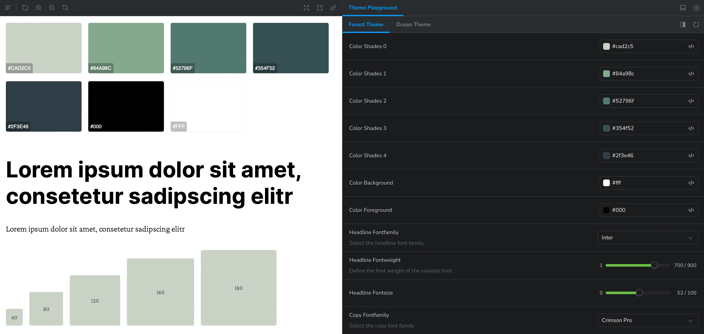

# storybook-addon-theme-playground

[](https://www.npmjs.com/package/storybook-addon-theme-playground)

`storybook-addon-theme-playground` is a theme addon for storybook. It provides a panel where theme values can be tweaked directly.


[🌍 Example](https://storybook-addon-theme-playground.now.sh)

## Features

- 🎛 Seperate panel with auto-generated controls for each theme value
- 🧬 Customizable controls based on your needs

## Table of Contents

- [Installation](#installation)
- [Multiple themes](#multiple-themes)
- [Parameters](#parameters)
- [Config](#config)
- [Controls](#controls)
- [Control components](#Control-components)
- [Default controls](#default-controls)
- [Typescript](#typescript)
- [Storybook Version](#storybook-version)
- [Migration](#migration)

## Installation

#### 1. Install the addon

```sh
npm install -D storybook-addon-theme-playground

yarn add -D storybook-addon-theme-playground
```

#### 2. Add the addon to your storybook config

Add to `.storybook/main.js`

```js
module.exports = {
  addons: ['storybook-addon-theme-playground']
};
```

#### 3. Add parameters

Add to `.storybook/preview.js`.

```js
import { ThemeProvider } from 'styled-components';

import theme from 'path/to/theme';

export const parameters = {
  themePlayground: {
    theme,
    provider: ThemeProvider
  }
};
```

## Multiple Themes

To add multiple themes, add an `Array` to the `theme` key. Each theme must have a `name` and a `theme` key.

```js
import { ThemeProvider } from 'styled-components';
import defaultTheme from 'path/to/default/theme';
import anotherTheme from 'path/to/another/theme';

const params = {
  theme: [
    { name: 'Theme', theme: defaultTheme },
    { name: 'Another Theme', theme: anotherTheme }
  ],
  provider: ThemeProvider
};

export const parameters = { themePlayground: params };
```

## Parameters

### `theme`

`object` | `Array<{ name: string, theme: object }>` | required

The theme `object` or multiple themes as an `array` of `objects`. Look at the [Multiple Themes](#multiple-themes) section for an example.

### `provider`

`any` | required

Any provider component which will accept a theme object prop and children. `storybook-addon-theme-playground` has no default provider due to extendability.

### `controls`

`object` | optional

Optional [control components](#control-components) of [default controls](#default-controls). Look at the [controls](#controls) section for detailed documentation.

### `config`

`object` | optional

An additional config object can be added. Look at the [Config](#config) section for detailed documentation.

### `config.labelFormat`

`"path" || "startCase" || (path: string[]) => string` | default: `"startCase"`

### `config.debounce`

`boolean` | default: `true`

Set to `false` updating the theme values will not be debounced.

### `config.debounceRate`

`number` | default: `500`

### `config.showCode`

`boolean` | default: `true`

Set to `false` no code component will be rendered.

## Config

**Example**

```js
import { ThemeProvider } from 'styled-components';

export const parameters = {
  themePlayground: {
    theme: { button: { color: '#000' } },
    provider: ThemeProvider,
    config: {
      // One of "path"
      labelFormat: 'path', // "button.color"
      // or "startCase"
      labelFormat: 'startCase', // "Button Color"
      // or a custom function
      labelFormat: (path) => {
        // path is equal to ["button", "color"]
        return path.join('-'); // "button-color"
      },
      debounce: true || false,
      debounceRate: 500,
      showConfig: true || false
    }
  }
};
```

## Controls

`storybook-addon-theme-playground` will render [default controls](#default-controls) based on the theme value. If you want to customize them, you can override the default controls by adding an `controls` object to the parameters.

As a key use the theme object path, e.g `'button.spacing'`.

All controls accept a `type`, `label`, `description` and `icon` prop.
You can use all icons from the [storybook styleguide](https://next--storybookjs.netlify.app/official-storybook/?path=/story/basics-icon--labels).

**Example**

```js
import { ThemeProvider } from 'styled-components';

import theme from 'path/to/theme';

const controls = {
  'button.spacing': {
    type: 'number',
    icon: 'expand',
    label: 'Button Spacing',
    description: 'Spacing for all buttons',
    min: 1,
    max: 20,
    steps: 1
  },
  'button.color.primary': {
    type: 'color',
    label: 'Button Primary Color'
  }
};

export const parameters = {
  themePlayground: { theme, controls, provider: ThemeProvider }
};
```

### Hide specific theme values

It is also possible to hide specific theme values or objects, e.g.:

```js
const controls = {
  breakpoints: {
    hidden: true
  },
  'button.spacing': {
    hidden: true
  }
};
```

## Control components

### Color

```js
'theme.path': {
  type: 'color',
  icon: string,
  hidden: boolean,
  label: string | 'Theme Path',
  description: string | null
}
```

### Number

```js
'theme.path': {
  type: 'number',
  icon: string,
  hidden: boolean,
  label: string | 'Theme Path',
  description: string | null,
  min: number | 0,
  max: number | 100,
  steps: number | 1
}
```

### Select

```js
'theme.path': {
  type: 'select',
  icon: string,
  hidden: boolean,
  label: string | 'Theme Path',
  description: string | null
  options: [
    {
      value: string | number,
      label: string
    }
  ]
}
```

### Shorthand

```js
'theme.path': {
  type: 'shorthand',
  icon: string,
  hidden: boolean,
  label: string | 'Theme Path',
  description: string | null
}
```

### Switch

```js
'theme.path': {
  type: 'switch',
  icon: string,
  hidden: boolean,
  label: string | 'Theme Path',
  description: string | null
}
```

### RadioGroup

```js
'theme.path': {
  type: 'radio',
  icon: string,
  hidden: boolean,
  label: string | 'Theme Path',
  description: string | null
  options: [
    {
      value: string,
      label: string
    }
  ]
}
```

### Range

```js
'theme.path': {
  type: 'range',
  icon: string,
  hidden: boolean,
  label: string | 'Theme Path',
  description: string | null,
  min: number | 0,
  max: number | 100,
  steps: number | 1
}
```

## Default controls

`storybook-addon-theme-playground` will render the following components based on the value.

### `Switch`

> `boolean`

### `Number`

> `number`

### `Input`

> `string`

### `Textarea`

> `string` && `string.length >= 40`

### `Range`

> `string` && `string.endsWith("px" || "rem" || "em" || "%")`

### `Color`

> `string` && `string.startsWith("#" || "rgba" || "rgba")` || `label.includes("color")`

### `Shorthand`

> `object` && `Object.keys(object).length === 4` && `Object.keys(object).includes("top" && "right" && "bottom" && "left")`

## Typescript

```ts
// .storybook/preview.ts

import {
  withThemePlayground,
  ThemePlaygroundProps
} from 'storybook-addon-theme-playground';

import theme from 'path/to/theme';

interface ThemePlaygroundParams extends ThemePlaygroundProps {
  theme: typeof theme;
}

const params: ThemePlaygroundParams = {
  theme,
  provider: ThemeProvider,
  controls: {
    'headline.fontWeight': {
      type: 'range',
      max: 900,
      min: 1,
      description: 'Define the font weight of the variable font'
    },
    'copy.fontWeight': {
      type: 'range',
      max: 900,
      min: 1,
      description: 'Define the font weight of the variable font'
    }
  }
};

export const parameters = { themePlayground: params };
```

## Migration

### Storybook Version

`storybook-addon-theme-playground` needs at least Storybook 6, because it uses some of the internal control components which came with the v6 release. If you need to support a smaller version of Storybook, please try to install the addon version `1.3.4`. [Or read about how to migrate to Storybook 6](https://medium.com/storybookjs/storybook-6-migration-guide-200346241bb5).

```sh
# For Storybook versions < 6.0
npm install -D storybook-addon-theme-playground@1.3.4
yarn add -D storybook-addon-theme-playground@1.3.4
```

### Addon version 2 migration

If you want to migrate the addon to version 2 follow these steps.

**1. Change the addons import inside `main.js`**

```js
// Before
module.exports = {
  addons: ['storybook-addon-theme-playground/dist/register']
};

// After
module.exports = {
  addons: ['storybook-addon-theme-playground']
};
```

**2. Change from decorators to parameters inside `preview.js`**

```js
// Before
import { ThemeProvider } from 'styled-components';
import { withThemePlayground } from 'storybook-addon-theme-playground';

import theme from 'path/to/theme';

export const decorators = [
  withThemePlayground({
    theme,
    provider: ThemeProvider
  })
];

// After
import { ThemeProvider } from 'styled-components';

import theme from 'path/to/theme';

export const parameters = {
  themePlayground: {
    theme,
    provider: ThemeProvider
  }
};
```

**3. Change key from overrides to controls inside configuration**

The overrides key was replaced by the controls key, if you customized the panel components rename the configuration key.

```js
// Before
const options = {
  theme,
  provider: ThemeProvider,
  overrides: {
    // Your customized controls
  }
};

// After
const options = {
  theme,
  provider: ThemeProvider,
  controls: {
    // Your customized controls
  }
};
```
